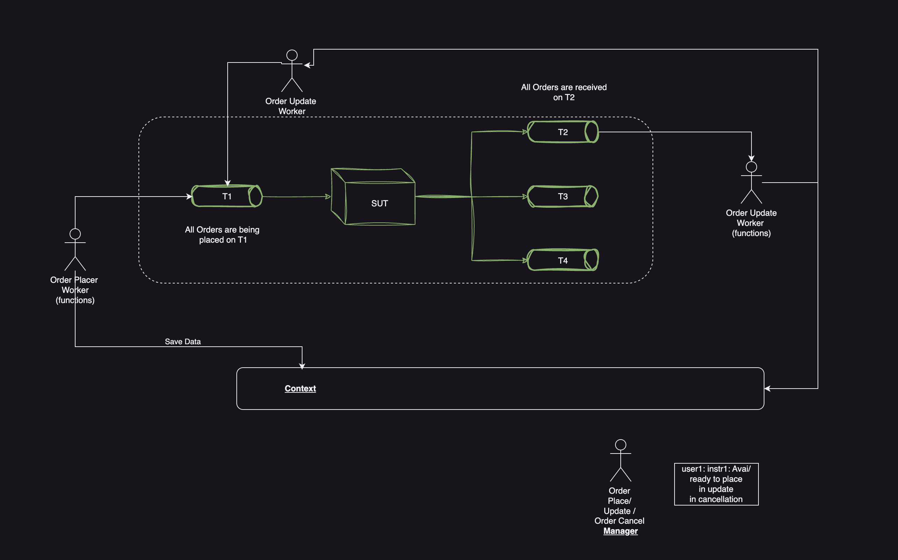
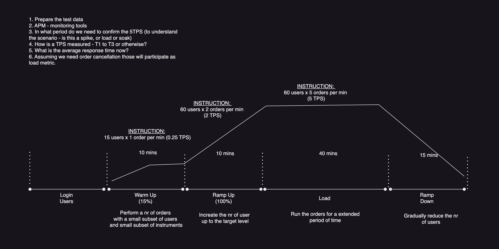
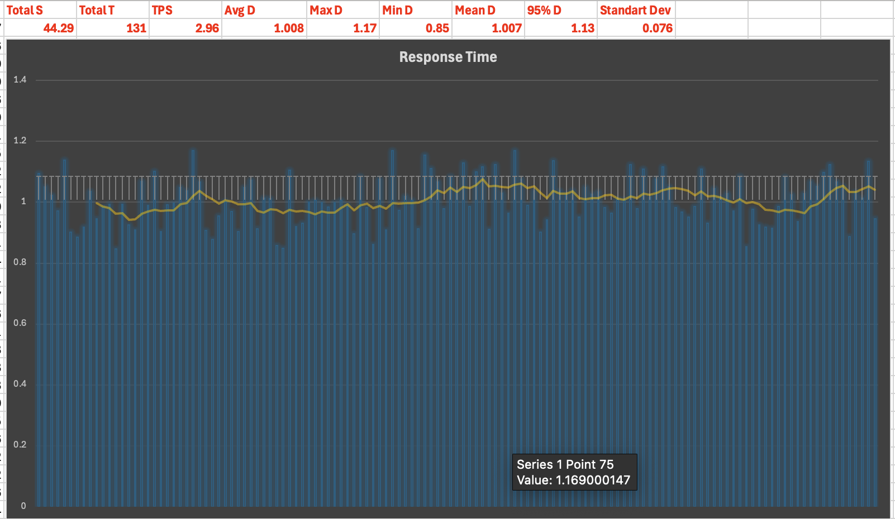
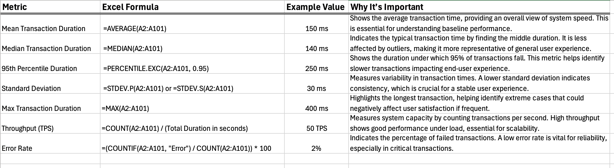

### Trading Simulator Load

TS project to simulate trading sub-system activity. The simulation is based on the following interaction diagram:

The scope was to create a generic representation of the trading sub-system and confirm its ability to support 200 users averaging 5 TPS for a 1h

### Simulate and Process Results

_NOTE: The projects required node and npm install and available._

1. Run `npm install` then `npx tsc` to compile the resources
2. Run the simulation `node dist/simulate.js`, let the system run for some time and then interup with `CTRL + C`
3. As part of the simulation, logs will be produced. Create a `report` folder inside the project, then run the log processor `node dist/log-parser/transactionsProcessor.js`
4. A CSV file will be produced which need to be processed (I used Excel)

#### Transaction Processing:

1. Process dates, both `start` and `end` by applying the following in new columns `=VALUE(SUBSTITUTE(SUBSTITUTE(B2, "T", " "), "Z", ""))`
2. Calculation duration, in new column `=(E2-D2)*86400`
3. Generate the following chart for duration
    
4. Calculate some additinal metrics
    
